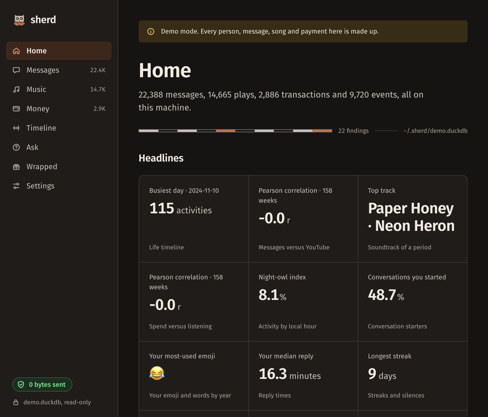

<div class="hero">
  
  <div class="eyebrow">Your data has a story</div>
  <h1>Find the shape of your life.</h1>
  <p>Point sherd at the exports you already own. In minutes, see your life in charts, ask it questions, and make a Wrapped worth keeping. Everything stays on your machine unless you choose otherwise.</p>
  <a class="cta" href="install/">Start a dig →</a>
</div>

<div class="verb-grid">
  <div class="verb"><h3>Dig</h3><p>Import exports from your messages, music, money, browser and shell.</p></div>
  <div class="verb"><h3>Show</h3><p>Open local dashboards and see the patterns hiding in plain sight.</p></div>
  <div class="verb"><h3>Ask</h3><p>Question your data with a local model or a provider you choose. See the SQL.</p></div>
</div>

## Begin with a demo

```sh
curl -LsSf https://raw.githubusercontent.com/Soimanul/sherd/main/scripts/install.sh | sh
sherd demo && sherd web
```

No account. No cloud. No telemetry. The demo uses synthetic data, so you can explore before importing anything.



[Explore the quickstart](quickstart.md) · [Read the privacy model](privacy.md)
